# Finance System Flowcharts

This document contains comprehensive flowcharts for the Payment Request Management System, covering all major workflows and processes.

---

## 1. System Overview & Architecture

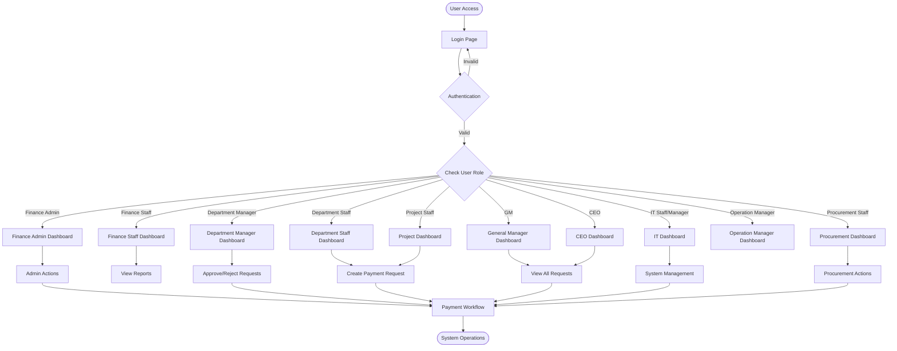

---

## 2. User Authentication & Role Routing Flow

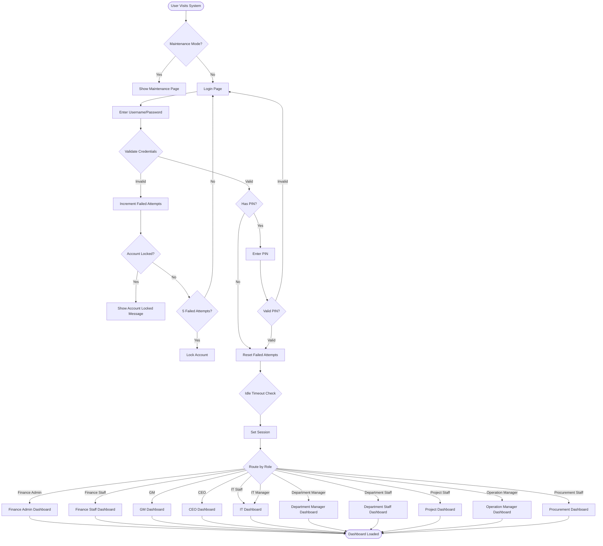

---

## 3. Payment Request Submission Flow

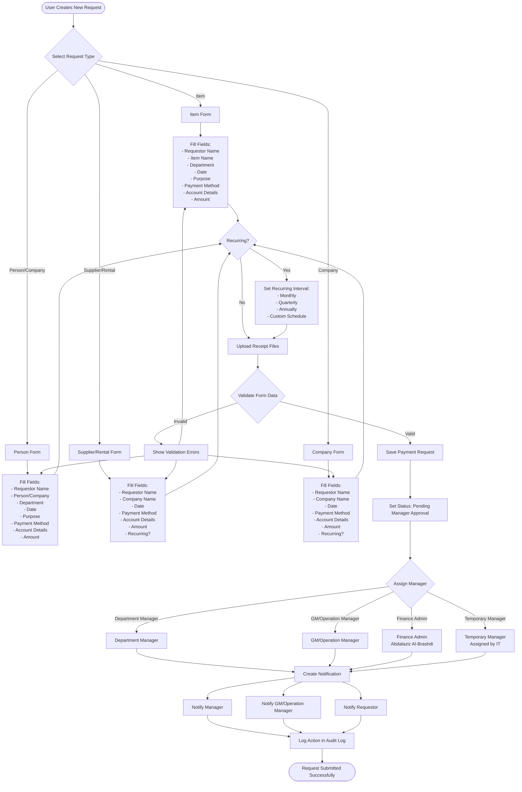

---

## 4. Approval Workflow - Manager Stage

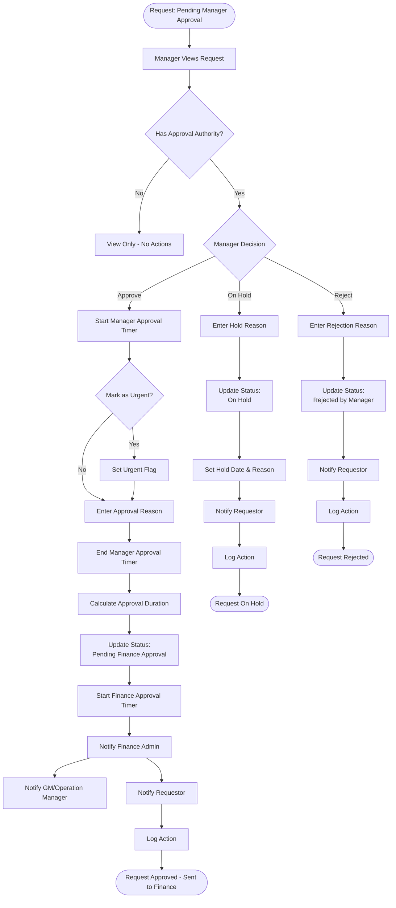

---

## 5. Approval Workflow - Finance Stage

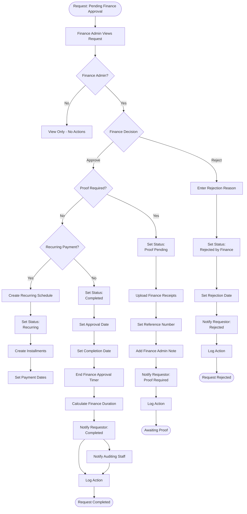

---

## 6. Proof of Payment Workflow

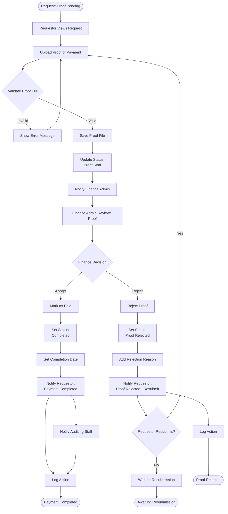

---

## 7. Recurring Payment Flow

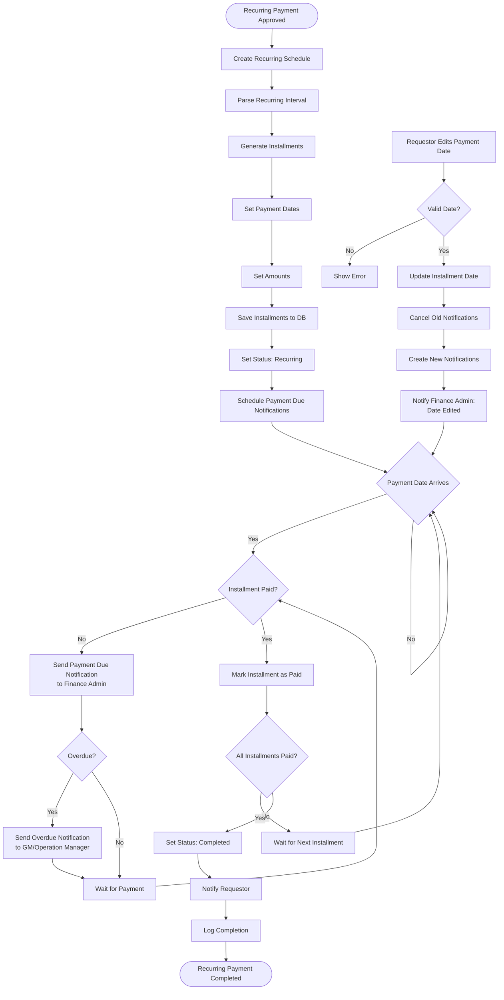

---

## 8. Cheque Management Flow

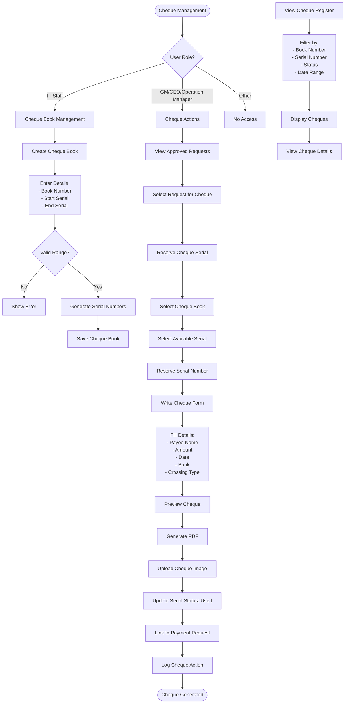

---

## 9. Procurement Item Request Flow

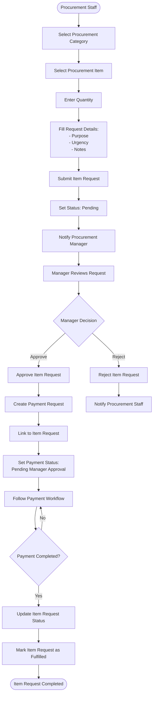

---

## 10. Notification System Flow

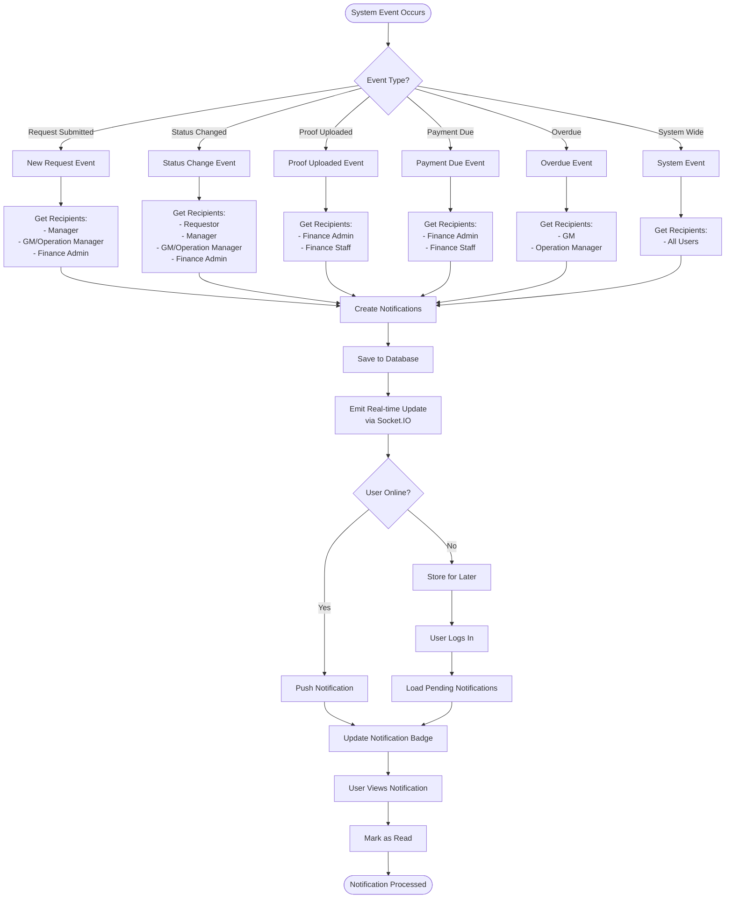

---

## 11. System Maintenance Flow

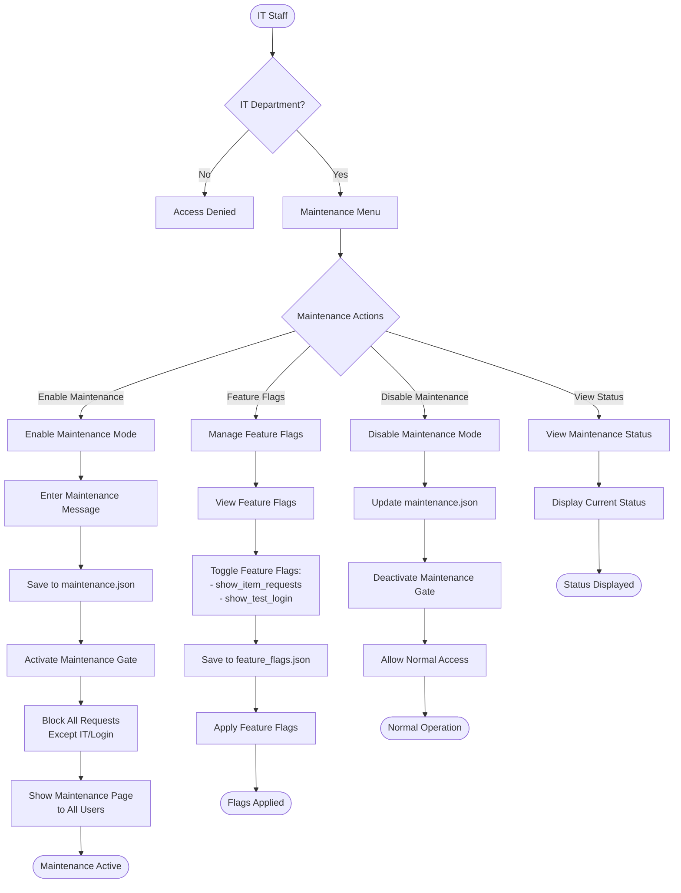

---

## 12. Audit Logging Flow

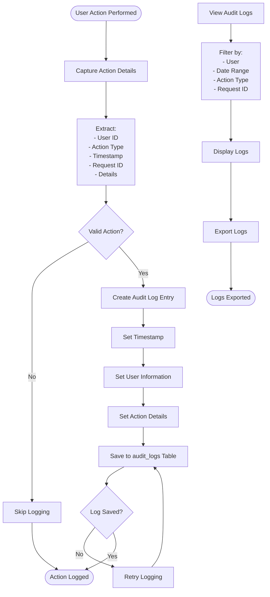

---

## Legend

### Shapes Used:
- **Rectangle**: Process/Action
- **Diamond**: Decision Point
- **Rounded Rectangle**: Start/End Point
- **Parallelogram**: Input/Output

### Status Flow:
1. **Pending Manager Approval** → Manager reviews
2. **Pending Finance Approval** → Finance reviews
3. **Proof Pending** → Awaiting proof upload
4. **Proof Sent** → Proof uploaded, awaiting review
5. **Recurring** → Recurring payment active
6. **Completed** → Request fully processed
7. **Rejected by Manager** → Manager rejected
8. **Rejected by Finance** → Finance rejected
9. **Proof Rejected** → Proof rejected, resubmit required

### Key Roles:
- **Finance Admin**: Mahmoud Al-Mandhari, Abdalaziz Al-Brashdi
- **General Manager**: Oversees all operations
- **Operation Manager**: Manages operations and projects
- **Department Managers**: Approve department requests
- **IT Staff**: System maintenance and management

---

## Notes

- All workflows include notification systems
- Audit logging is performed for all critical actions
- Real-time updates via Socket.IO for status changes
- Role-based access control enforced at every step
- Maintenance mode can be enabled by IT staff
- Feature flags allow IT to toggle features temporarily

---

## 13. Recurring Cheque Payment Day Calculation Logic

### Overview
For **Cheque + Recurring** payment requests, the system calculates and displays the number of days for each payment date. This helps track how many days each cheque covers within its respective month.

### Calculation Rules

#### **Rule 1: First Payment Date (First Installment)**
For the **first payment date** in the recurring schedule:
- **Calculate**: Days from the payment date to the **end of that month** (excluding the payment date itself)
- **Formula**: `Days = Last Day of Month - Payment Day`
- **Purpose**: Shows how many days the first cheque covers in its initial month

**Example:**
- Payment Date: **December 11, 2025**
- December has **31 days**
- Calculation: 31 - 11 = **20 days**
- Meaning: The cheque covers 20 days from Dec 11 to Dec 31 (excluding Dec 11 itself)

#### **Rule 2: Subsequent Payment Dates (All Other Installments)**
For **all payment dates after the first one**:
- **Calculate**: Days from the **first day of the month** to the payment date (excluding the payment date itself)
- **Formula**: `Days = Payment Day - 1`
- **Purpose**: Shows how many days the cheque covers from the start of its month

**Examples:**

1. **December 21, 2025** (2nd installment)
   - Calculation: 21 - 1 = **20 days**
   - Meaning: The cheque covers 20 days from Dec 1 to Dec 21 (excluding Dec 21 itself)

2. **December 31, 2025** (3rd installment)
   - Calculation: 31 - 1 = **30 days**
   - Meaning: The cheque covers 30 days from Dec 1 to Dec 31 (excluding Dec 31 itself)

3. **May 1, 2026** (4th installment)
   - Calculation: 1 - 1 = **0 days**
   - Meaning: The cheque is due on the first day of the month, so it covers 0 days from the start

4. **May 15, 2026** (5th installment)
   - Calculation: 15 - 1 = **14 days**
   - Meaning: The cheque covers 14 days from May 1 to May 15 (excluding May 15 itself)

5. **May 30, 2026** (6th installment)
   - Calculation: 30 - 1 = **29 days**
   - Meaning: The cheque covers 29 days from May 1 to May 30 (excluding May 30 itself)

### Visual Example

```
Payment Schedule for Recurring Cheque:

2025-12-11 (20 days)  ← First payment: 20 days remaining in December
2025-12-21 (20 days)  ← Subsequent: 20 days from start of December
2025-12-31 (30 days)  ← Subsequent: 30 days from start of December
2026-05-01 (0 days)   ← Subsequent: 0 days (due on 1st of month)
2026-05-15 (14 days)  ← Subsequent: 14 days from start of May
2026-05-30 (29 days)  ← Subsequent: 29 days from start of May
```

### Why This Logic?

1. **First Payment**: Represents the **remaining days** in the first month from when the payment starts
2. **Subsequent Payments**: Represents the **coverage period** from the beginning of each month to the payment date
3. **Business Purpose**: Helps finance track:
   - How many days each cheque payment period covers
   - The billing cycle for each installment
   - Cash flow planning and reconciliation

### Important Notes

- This calculation **only applies** to requests where:
  - `payment_method = 'Cheque'` **AND**
  - `recurring = 'Recurring'`
- For other payment methods (Card) or one-time payments, dates are shown **without day calculations**
- The calculation is **automatic** and displayed in reports and request views
- Days are calculated **exclusively** (the payment date itself is not counted)

